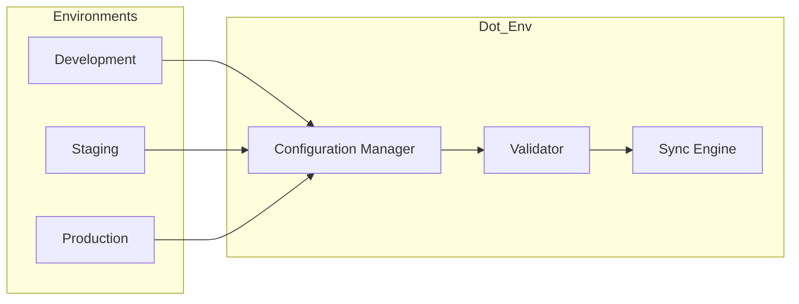
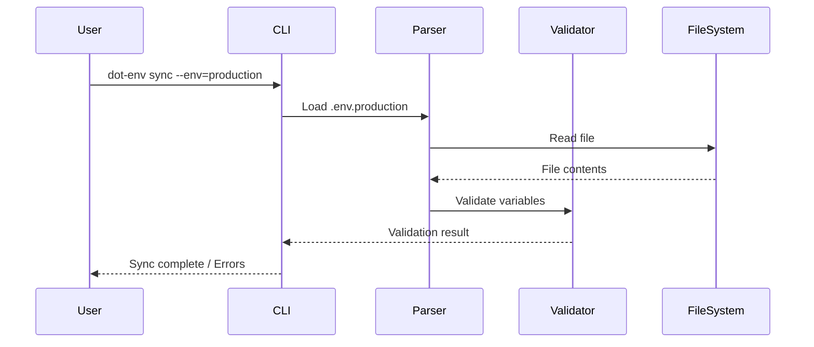
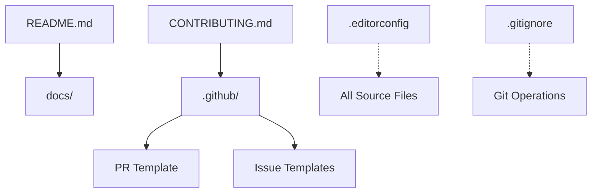

# 🏗️ Architecture

> System design and component overview for Dot_Env.

---

## Current State

> [!IMPORTANT]
> **This repository is currently a scaffold.** No core application code has been implemented yet.

This document describes the **intended** architecture based on the project's stated purpose and existing configuration.

---

## Project Vision

Dot_Env aims to manage environment variables and configuration files across multiple environments:

---

## Repository Layers

### Layer 1: Repository Hygiene (✅ Implemented)

Files that establish project standards and community guidelines.

| Component | File | Purpose |
|-----------|------|---------|
| License | [LICENSE](../LICENSE) | MIT License terms |
| Contributing | [CONTRIBUTING.md](../CONTRIBUTING.md) | PR workflow |
| Security | [SECURITY.md](../SECURITY.md) | Vulnerability reporting |
| Conduct | [CODE_OF_CONDUCT.md](../CODE_OF_CONDUCT.md) | Community standards |

### Layer 2: Development Configuration (✅ Implemented)

| Component | File | Purpose |
|-----------|------|---------|
| Editor Config | [.editorconfig](../.editorconfig) | Consistent formatting |
| Git Ignore | [.gitignore](../.gitignore) | Exclude build artifacts |

### Layer 3: GitHub Integration (✅ Implemented)

| Component | File | Purpose |
|-----------|------|---------|
| PR Template | [.github/PULL_REQUEST_TEMPLATE.md](../.github/PULL_REQUEST_TEMPLATE.md) | Standardize PRs |
| Bug Template | [.github/ISSUE_TEMPLATE/bug_report.md](../.github/ISSUE_TEMPLATE/bug_report.md) | Bug reports |
| Feature Template | [.github/ISSUE_TEMPLATE/feature_request.md](../.github/ISSUE_TEMPLATE/feature_request.md) | Feature requests |

### Layer 4: Application Code (❌ Not Implemented)

**Expected components (not yet created):**

| Component | Expected Path | Purpose |
|-----------|---------------|---------|
| Entry Point | `src/index.js` or `src/main.py` | Application entry |
| Config Parser | `src/parser/` | Parse .env files |
| Validator | `src/validator/` | Validate env vars |
| CLI | `src/cli/` | Command-line interface |
| Tests | `tests/` | Test suite |

---

## Data Flow (Conceptual)

---

## Component Dependencies

---

## Design Decisions

### Why MIT License?

- **File:** [LICENSE](../LICENSE#L1)
- **Rationale:** Maximizes adoption; minimal restrictions

### Why Conventional Commits?

- **File:** [CONTRIBUTING.md](../CONTRIBUTING.md#L16)
- **Rationale:** Enables automated changelog generation; clear commit history

### Why 2-space indentation?

- **File:** [.editorconfig](../.editorconfig#L4-L5)
- **Rationale:** Common JavaScript/web convention; saves horizontal space

---

## Future Architecture Recommendations

When implementing core functionality, consider:

1. **Modular Design** — Separate parsing, validation, and I/O
2. **Schema Validation** — Define required vs optional env vars
3. **Multi-format Support** — `.env`, `.yaml`, `.json`
4. **Secret Handling** — Never log sensitive values
5. **Dry-run Mode** — Preview changes before applying

---

*Document Status: Conceptual (no code implemented)*
