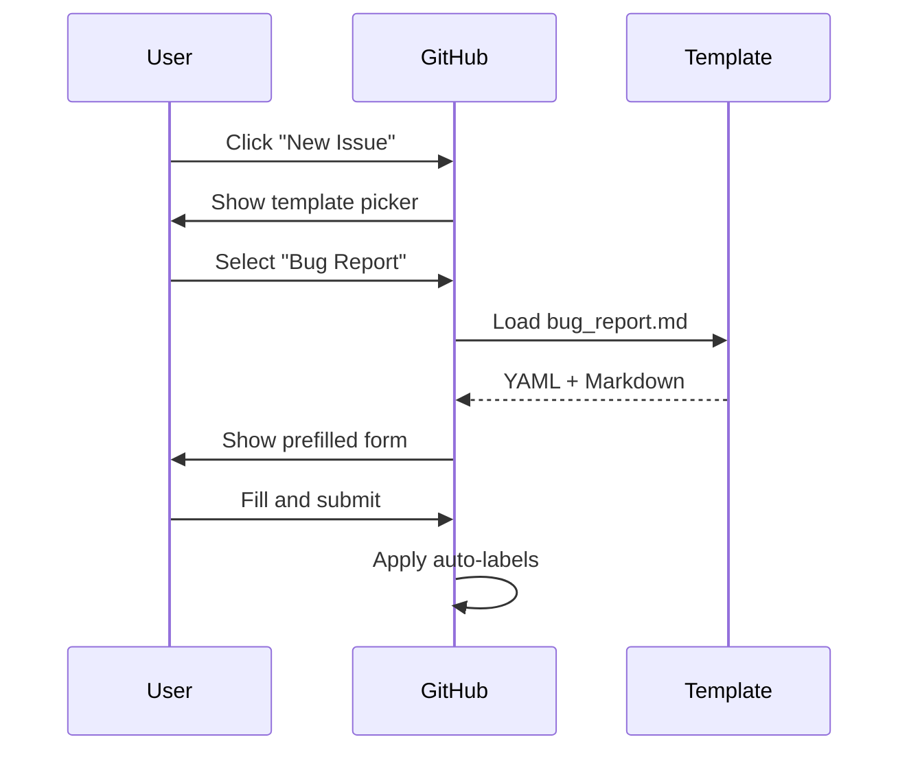

# GitHub Templates Reference

> Deep dive into [/.github/](../../.github/) templates

---

## Directory Overview

| Property | Value |
|----------|-------|
| **Path** | `/.github/` |
| **Purpose** | GitHub-specific configuration and templates |
| **Files** | 3 (1 PR template, 2 issue templates) |

---

## Files in This Directory

```
.github/
├── PULL_REQUEST_TEMPLATE.md     # PR template
└── ISSUE_TEMPLATE/
    ├── bug_report.md            # Bug report template
    └── feature_request.md       # Feature request template
```

---

## PULL_REQUEST_TEMPLATE.md

**Path:** `/.github/PULL_REQUEST_TEMPLATE.md`
**Lines:** 22
**Bytes:** 354

### Purpose

Automatically populates the PR description when contributors create a pull request.

### Structure

```markdown
## Description
<!-- What does this PR do? -->

## Type of Change
- [ ] Bug fix
- [ ] New feature
- [ ] Breaking change
- [ ] Documentation update

## Checklist
- [ ] Tests pass locally
- [ ] Code follows project style
- [ ] Self-reviewed my changes
- [ ] Updated documentation (if needed)

## Related Issues
<!-- Closes #123 -->
```

### Features

| Feature | Description |
|---------|-------------|
| Description | Free-form PR explanation |
| Type checkboxes | Categorize the change |
| Checklist | Pre-merge requirements |
| Issue linking | Connect to related issues |

---

## Bug Report Template

**Path:** `/.github/ISSUE_TEMPLATE/bug_report.md`
**Lines:** 34
**Bytes:** 407

### YAML Frontmatter

```yaml
---
name: Bug Report
about: Report a bug to help us improve
title: '[BUG] '
labels: bug
---
```

| Field | Value | Effect |
|-------|-------|--------|
| `name` | "Bug Report" | Display name in GitHub UI |
| `about` | "Report a bug..." | Description in template picker |
| `title` | `[BUG]` | Prefills issue title |
| `labels` | `bug` | Auto-applies `bug` label |

### Body Structure

| Section | Purpose |
|---------|---------|
| Description | What's broken |
| Steps to Reproduce | How to trigger the bug |
| Expected Behavior | What should happen |
| Actual Behavior | What happens instead |
| Environment | OS, version info |
| Additional Context | Screenshots, logs |

---

## Feature Request Template

**Path:** `/.github/ISSUE_TEMPLATE/feature_request.md`
**Lines:** 23
**Bytes:** 365

### YAML Frontmatter

```yaml
---
name: Feature Request
about: Suggest an idea for this project
title: '[FEATURE] '
labels: feature
---
```

| Field | Value | Effect |
|-------|-------|--------|
| `name` | "Feature Request" | Display name |
| `about` | "Suggest an idea..." | Description |
| `title` | `[FEATURE]` | Prefills title |
| `labels` | `feature` | Auto-applies `feature` label |

### Body Structure

| Section | Purpose |
|---------|---------|
| Problem | Why this is needed |
| Proposed Solution | How it should work |
| Alternatives Considered | Other options |
| Additional Context | Mockups, examples |

---

## How Templates Work



---

## Error Handling

**YAML Errors:**

- Invalid frontmatter causes template to not appear
- Validate with: <https://github.com/><user>/<repo>/issues/new/choose

**Missing Labels:**

- If `labels: bug` references a non-existent label, it's ignored
- Labels must be created in repo settings first

---

## How to Modify Safely

1. Edit in a feature branch
2. Test by creating a draft issue/PR
3. Ensure YAML frontmatter is valid
4. Keep placeholders helpful but concise

**Adding a new template:**

1. Create file in `/.github/ISSUE_TEMPLATE/`
2. Add YAML frontmatter with `name`, `about`, `title`, `labels`
3. Add Markdown body with sections
4. Push and test

---

## Related Documentation

- [WORKFLOWS.md](../WORKFLOWS.md) — Git workflow reference
- [CONTRIBUTING.md](../../CONTRIBUTING.md) — Contribution guidelines

---

*Files last modified: Initial commit (`c3bc5fc`)*
