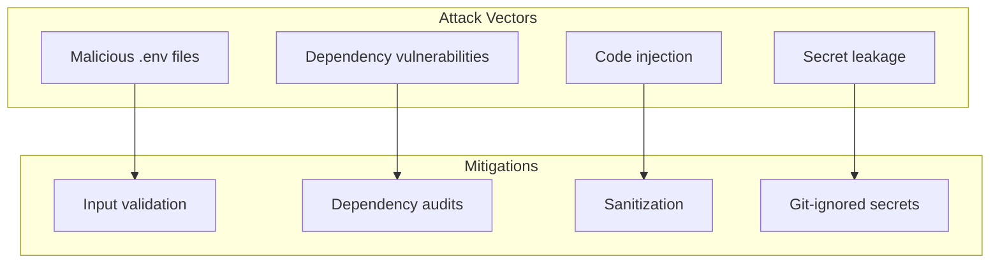

# 🔒 Security Documentation

> Threat model, secret handling, permissions, and supply-chain security for Dot_Env.

---

## Security Policy

The main security policy is documented in [/SECURITY.md](../SECURITY.md).

### Vulnerability Reporting

From [SECURITY.md](../SECURITY.md#L3-L11):

1. **Do NOT** open a public issue
2. Email the maintainer directly or use GitHub's private vulnerability reporting
3. Include steps to reproduce and potential impact
4. Response time: **48 hours**

---

## Threat Model

### Current Attack Surface

Since this is a scaffold with no code, the attack surface is minimal:

| Asset | Threat | Mitigation |
|-------|--------|------------|
| Repository access | Unauthorized commits | GitHub branch protection* |
| Dependencies | Supply chain attack | No dependencies yet |
| Secrets | Credential exposure | No secrets yet |

*Note: Branch protection requires GitHub Pro for private repos.

### Future Attack Surface (When Code Exists)



---

## Secret Handling

### Current State

| Secret Type | Handling | Status |
|-------------|----------|--------|
| `.env` files | Git-ignored | ✅ Configured |
| API keys | Not applicable | N/A |
| Tokens | Not applicable | N/A |

### .gitignore Protection

**File:** [.gitignore](../.gitignore#L5-L8)

```gitignore
# Environment files are excluded from git
.env
.env.local
.env.*.local
```

### Recommendations

1. **Never commit** `.env` files with real secrets
2. **Use** `.env.example` with placeholder values
3. **Rotate** credentials if accidentally committed
4. **Audit** git history: `git log --all --full-history -- "*.env"`

---

## Permissions Model

### GitHub Repository

| Role | Permissions |
|------|-------------|
| Owner | Full access |
| Maintainer | Write, merge PRs |
| Contributor | Fork, submit PRs |
| Viewer | Read only |

### File Permissions

All files should be world-readable (644 for files, 755 for directories).

---

## Supply Chain Security

### Current Dependencies

**None.** No `package.json`, `requirements.txt`, or similar dependency manifest exists.

### When Adding Dependencies

1. **Audit** before adding: check npm/PyPI download counts, maintenance activity
2. **Pin versions** in lock files
3. **Enable** Dependabot (GitHub) for automated updates
4. **Run** `npm audit` or equivalent regularly

### Recommended Tooling

| Tool | Purpose |
|------|---------|
| Dependabot | Automated dependency updates |
| npm audit | Node.js vulnerability scan |
| Snyk | Multi-language security scanning |
| Socket | Supply chain attack detection |

---

## Security Checklist for Contributors

Before submitting a PR:

- [ ] No secrets in code or commits
- [ ] No hardcoded credentials
- [ ] Input validation for user-provided data
- [ ] Dependencies audited
- [ ] Sensitive data masked in logs

---

## Incident Response

### If Secrets Are Exposed

1. **Immediately** rotate the credential
2. **Remove** from git history: use `git filter-branch` or BFG Repo-Cleaner
3. **Audit** access logs for unauthorized use
4. **Notify** affected parties

### Contact

For security issues, see [SECURITY.md](../SECURITY.md).

---

## Compliance

| Standard | Status |
|----------|--------|
| OWASP Top 10 | ⚪ Not applicable (no code) |
| SOC 2 | ⚪ Not applicable |
| GDPR | ⚪ Not applicable |

---

*Document Status: Complete for current scaffold*
