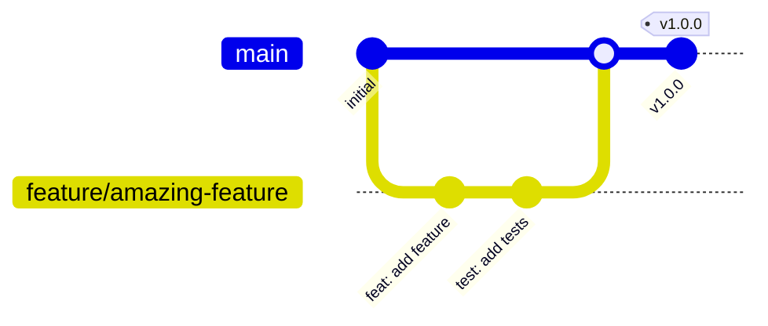
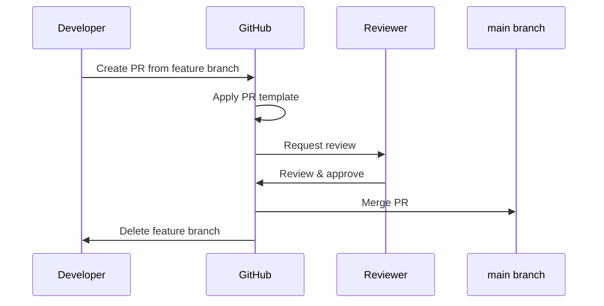

# 🔄 Workflows

> CI/CD pipelines, branching strategy, release process, and automation for Dot_Env.

---

## Current State

> [!IMPORTANT]
> **No CI/CD pipelines are configured.** The `/.github/workflows/` directory does not exist.

This document describes the intended workflows based on existing templates and conventions.

---

## Branching Strategy

### Recommended: GitHub Flow



### Branch Naming Convention

| Prefix | Purpose | Example |
|--------|---------|---------|
| `feature/` | New features | `feature/env-parser` |
| `fix/` | Bug fixes | `fix/validation-error` |
| `docs/` | Documentation | `docs/api-reference` |
| `chore/` | Maintenance | `chore/update-deps` |

**Source:** [CONTRIBUTING.md](../CONTRIBUTING.md#L8)

---

## Commit Convention

This project uses [Conventional Commits](https://www.conventionalcommits.org/).

### Format

```
<type>(<scope>): <description>

[optional body]

[optional footer(s)]
```

### Types

| Type | Description | Example |
|------|-------------|---------|
| `feat` | New feature | `feat: add env validation` |
| `fix` | Bug fix | `fix: handle empty files` |
| `docs` | Documentation | `docs: update README` |
| `chore` | Maintenance | `chore: update gitignore` |
| `test` | Tests | `test: add parser tests` |
| `refactor` | Code refactoring | `refactor: simplify parser` |

**Source:** [CONTRIBUTING.md](../CONTRIBUTING.md#L16)

---

## Pull Request Workflow

### Template Structure

**File:** [.github/PULL_REQUEST_TEMPLATE.md](../.github/PULL_REQUEST_TEMPLATE.md)

```markdown
## Description
<!-- What does this PR do? -->

## Type of Change
- [ ] Bug fix
- [ ] New feature
- [ ] Breaking change
- [ ] Documentation update

## Checklist
- [ ] Tests pass locally
- [ ] Code follows project style
- [ ] Self-reviewed my changes
- [ ] Updated documentation (if needed)

## Related Issues
<!-- Closes #123 -->
```

### PR Flow



---

## Issue Workflow

### Bug Reports

**Template:** [.github/ISSUE_TEMPLATE/bug_report.md](../.github/ISSUE_TEMPLATE/bug_report.md)

| Field | Purpose |
|-------|---------|
| Description | What's broken |
| Steps to Reproduce | How to trigger |
| Expected Behavior | What should happen |
| Actual Behavior | What happens instead |
| Environment | OS, version info |

**Auto-labels:** `bug`

### Feature Requests

**Template:** [.github/ISSUE_TEMPLATE/feature_request.md](../.github/ISSUE_TEMPLATE/feature_request.md)

| Field | Purpose |
|-------|---------|
| Problem | Why this is needed |
| Proposed Solution | How it should work |
| Alternatives | Other options considered |

**Auto-labels:** `feature`

---

## CI/CD Pipelines

> [!WARNING]
> **No pipelines configured.** The following are recommendations.

### Recommended: GitHub Actions

#### `.github/workflows/ci.yml` (Not Created)

```yaml
# RECOMMENDATION - not yet implemented
name: CI

on:
  push:
    branches: [main]
  pull_request:
    branches: [main]

jobs:
  test:
    runs-on: ubuntu-latest
    steps:
      - uses: actions/checkout@v4
      - uses: actions/setup-node@v4
        with:
          node-version: '18'
      - run: npm ci
      - run: npm test
      - run: npm run lint
```

#### `.github/workflows/release.yml` (Not Created)

```yaml
# RECOMMENDATION - not yet implemented
name: Release

on:
  push:
    tags: ['v*']

jobs:
  publish:
    runs-on: ubuntu-latest
    steps:
      - uses: actions/checkout@v4
      - uses: actions/setup-node@v4
      - run: npm ci
      - run: npm publish
```

---

## Release Process

### Recommended Versioning: Semantic Versioning

```
MAJOR.MINOR.PATCH
  │      │     └── Bug fixes
  │      └──────── New features (backward compatible)
  └─────────────── Breaking changes
```

### Release Checklist

1. [ ] All tests pass
2. [ ] CHANGELOG.md updated
3. [ ] Version bumped in package.json
4. [ ] Create git tag: `git tag v1.0.0`
5. [ ] Push tag: `git push origin v1.0.0`
6. [ ] Create GitHub release

---

## Git Hooks

> [!NOTE]
> **No git hooks configured.** Consider using [husky](https://github.com/typicode/husky).

### Recommended Hooks

| Hook | Purpose | Tool |
|------|---------|------|
| `pre-commit` | Lint staged files | lint-staged |
| `commit-msg` | Validate commit message | commitlint |
| `pre-push` | Run tests | npm test |

---

## Automation Scripts

### repo-scan.py

**Path:** `/scripts/repo-scan.py`
**Purpose:** Regenerate REPO_MAP.md and dependency info

```bash
# Run from repo root
python scripts/repo-scan.py
```

---

## Labels

The following labels are configured in GitHub:

| Label | Color | Purpose |
|-------|-------|---------|
| `bug` | #d73a4a | Bug reports |
| `feature` | #0E8A16 | Feature requests |
| `docs` | #0075CA | Documentation |
| `chore` | #FEF2C0 | Maintenance |
| `priority` | #D93F0B | High priority |
| `enhancement` | #a2eeef | Improvements |
| `good first issue` | #7057ff | Beginner-friendly |
| `help wanted` | #008672 | Needs assistance |

---

*Document Status: Partial (no CI/CD implemented)*
